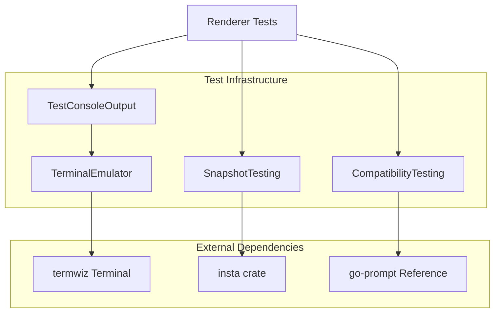
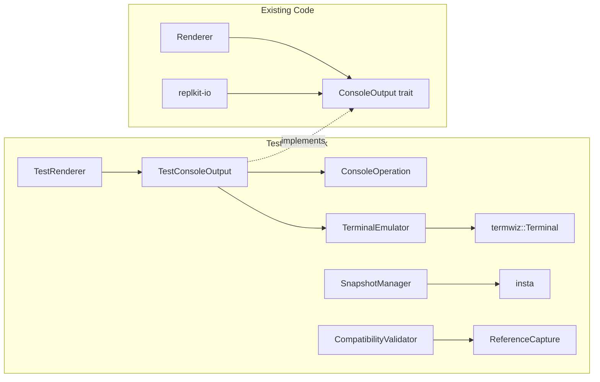

# Design Document

## Overview

This design outlines an automated testing framework for terminal rendering in replkit that uses termwiz for terminal emulation and provides go-prompt compatibility validation. The framework will enable confident refactoring of the renderer while ensuring visual output matches the proven go-prompt reference implementation.

## Architecture

### High-Level Architecture



### Component Architecture



## Module Structure

### File Organization

```
crates/replkit/
├── src/
│   ├── renderer.rs              # Existing renderer
│   └── lib.rs
└── tests/                       # Integration tests
    ├── test_console.rs      # TestConsoleOutput
    ├── terminal_emulator.rs # TerminalEmulator
    ├── snapshot_manager.rs  # Snapshot utilities
    └── compatibility.rs     # go-prompt validation
```

## Components and Interfaces

### 1. TestConsoleOutput

The core testing component that implements the `ConsoleOutput` trait and captures all operations.

```rust
pub struct TestConsoleOutput {
    operations: Vec<ConsoleOperation>,
    terminal_emulator: TerminalEmulator,
    capture_mode: CaptureMode,
}

#[derive(Debug, Clone, PartialEq)]
pub enum ConsoleOperation {
    MoveCursor { row: u16, col: u16 },
    WriteText { text: String },
    SetStyle { style: TextStyle },
    ResetStyle,
    Clear { clear_type: ClearType },
    Flush,
    HideCursor,
    ShowCursor,
    GetCursorPosition,
}

pub enum CaptureMode {
    Operations,      // Capture operation sequence
    TerminalState,   // Use termwiz emulation
    Both,           // Capture both for comparison
}

impl ConsoleOutput for TestConsoleOutput {
    fn write_text(&mut self, text: &str) -> Result<(), ConsoleError> {
        self.operations.push(ConsoleOperation::WriteText { 
            text: text.to_string() 
        });
        self.terminal_emulator.write_text(text)?;
        Ok(())
    }
    
    fn move_cursor_to(&mut self, row: u16, col: u16) -> Result<(), ConsoleError> {
        self.operations.push(ConsoleOperation::MoveCursor { row, col });
        self.terminal_emulator.move_cursor_to(row, col)?;
        Ok(())
    }
    
    // ... other trait methods
}
```

### 2. TerminalEmulator

Wraps termwiz to provide terminal emulation capabilities.

```rust
pub struct TerminalEmulator {
    terminal: termwiz::terminal::Terminal,
    screen_size: (u16, u16),
}

impl TerminalEmulator {
    pub fn new(cols: u16, rows: u16) -> Self {
        let terminal = termwiz::terminal::Terminal::new(cols as usize, rows as usize);
        Self {
            terminal,
            screen_size: (cols, rows),
        }
    }
    
    pub fn write_text(&mut self, text: &str) -> Result<(), ConsoleError> {
        self.terminal.add_change(termwiz::surface::Change::Text(text.to_string()));
        Ok(())
    }
    
    pub fn get_screen_contents(&self) -> String {
        self.terminal.render_to_string()
    }
    
    pub fn get_cursor_position(&self) -> (u16, u16) {
        let pos = self.terminal.cursor_position();
        (pos.y as u16, pos.x as u16)
    }
    
    pub fn get_screen_lines(&self) -> Vec<String> {
        (0..self.screen_size.1)
            .map(|row| self.terminal.get_line_text(row as usize))
            .collect()
    }
}
```

### 3. Test Utilities

Helper functions and macros for common testing patterns.

```rust
pub struct TestRenderer {
    renderer: Renderer,
    console: TestConsoleOutput,
}

impl TestRenderer {
    pub fn new() -> Self {
        let console = TestConsoleOutput::new(80, 24);
        let renderer = Renderer::new(Box::new(console.clone()));
        Self { renderer, console }
    }
    
    pub fn with_size(cols: u16, rows: u16) -> Self {
        let console = TestConsoleOutput::new(cols, rows);
        let renderer = Renderer::new(Box::new(console.clone()));
        Self { renderer, console }
    }
    
    pub fn get_operations(&self) -> &[ConsoleOperation] {
        &self.console.operations
    }
    
    pub fn get_screen_contents(&self) -> String {
        self.console.terminal_emulator.get_screen_contents()
    }
    
    pub fn assert_cursor_at(&self, row: u16, col: u16) {
        let pos = self.console.terminal_emulator.get_cursor_position();
        assert_eq!(pos, (row, col), "Cursor position mismatch");
    }
    
    pub fn assert_line_contains(&self, line: u16, expected: &str) {
        let lines = self.console.terminal_emulator.get_screen_lines();
        assert!(
            lines[line as usize].contains(expected),
            "Line {} does not contain '{}': '{}'", 
            line, expected, lines[line as usize]
        );
    }
}

// Convenience macros
macro_rules! assert_operations {
    ($renderer:expr, [$($op:expr),*]) => {
        let ops = $renderer.get_operations();
        let expected = vec![$($op),*];
        assert_eq!(ops, &expected, "Operation sequence mismatch");
    };
}
```

### 4. Snapshot Testing Integration

Integration with the `insta` crate for snapshot testing.

```rust
pub struct SnapshotManager {
    test_name: String,
}

impl SnapshotManager {
    pub fn new(test_name: &str) -> Self {
        Self {
            test_name: test_name.to_string(),
        }
    }
    
    pub fn assert_terminal_snapshot(&self, renderer: &TestRenderer) {
        let screen_contents = renderer.get_screen_contents();
        insta::assert_snapshot!(
            format!("{}_terminal", self.test_name),
            screen_contents
        );
    }
    
    pub fn assert_operations_snapshot(&self, renderer: &TestRenderer) {
        let operations = renderer.get_operations();
        let formatted = self.format_operations(operations);
        insta::assert_snapshot!(
            format!("{}_operations", self.test_name),
            formatted
        );
    }
    
    fn format_operations(&self, operations: &[ConsoleOperation]) -> String {
        operations
            .iter()
            .enumerate()
            .map(|(i, op)| format!("{:2}: {:?}", i, op))
            .collect::<Vec<_>>()
            .join("\n")
    }
}
```

### 5. go-prompt Compatibility Validation

Tools for comparing replkit output with go-prompt reference behavior.

```rust
pub struct CompatibilityValidator {
    reference_data: HashMap<String, ReferenceOutput>,
}

#[derive(Debug, Clone)]
pub struct ReferenceOutput {
    pub scenario: String,
    pub terminal_output: String,
    pub cursor_position: (u16, u16),
    pub operations: Vec<String>, // Simplified operation descriptions
}

impl CompatibilityValidator {
    pub fn load_references() -> Self {
        // Load reference outputs from files or embedded data
        let reference_data = Self::load_reference_files();
        Self { reference_data }
    }
    
    pub fn validate_scenario(&self, scenario: &str, renderer: &TestRenderer) -> CompatibilityResult {
        let reference = self.reference_data.get(scenario)
            .expect(&format!("No reference data for scenario: {}", scenario));
        
        let actual_output = renderer.get_screen_contents();
        let actual_cursor = renderer.console.terminal_emulator.get_cursor_position();
        
        CompatibilityResult {
            scenario: scenario.to_string(),
            matches: actual_output == reference.terminal_output && 
                    actual_cursor == reference.cursor_position,
            differences: self.compute_differences(&reference, &actual_output, actual_cursor),
        }
    }
    
    fn compute_differences(&self, reference: &ReferenceOutput, actual: &str, cursor: (u16, u16)) -> Vec<Difference> {
        let mut differences = Vec::new();
        
        if actual != reference.terminal_output {
            differences.push(Difference::TerminalOutput {
                expected: reference.terminal_output.clone(),
                actual: actual.to_string(),
            });
        }
        
        if cursor != reference.cursor_position {
            differences.push(Difference::CursorPosition {
                expected: reference.cursor_position,
                actual: cursor,
            });
        }
        
        differences
    }
}

#[derive(Debug)]
pub struct CompatibilityResult {
    pub scenario: String,
    pub matches: bool,
    pub differences: Vec<Difference>,
}

#[derive(Debug)]
pub enum Difference {
    TerminalOutput { expected: String, actual: String },
    CursorPosition { expected: (u16, u16), actual: (u16, u16) },
}
```

## Data Models

### Test Configuration

```rust
#[derive(Debug, Clone)]
pub struct TestConfig {
    pub terminal_size: (u16, u16),
    pub capture_mode: CaptureMode,
    pub enable_snapshots: bool,
    pub enable_compatibility_checks: bool,
}

impl Default for TestConfig {
    fn default() -> Self {
        Self {
            terminal_size: (80, 24),
            capture_mode: CaptureMode::Both,
            enable_snapshots: true,
            enable_compatibility_checks: true,
        }
    }
}
```

### Test Scenarios

```rust
#[derive(Debug, Clone)]
pub struct TestScenario {
    pub name: String,
    pub description: String,
    pub setup: Box<dyn Fn(&mut TestRenderer)>,
    pub expected_operations: Option<Vec<ConsoleOperation>>,
    pub validation: Box<dyn Fn(&TestRenderer) -> bool>,
}
```

## Error Handling

```rust
#[derive(Debug, thiserror::Error)]
pub enum TestError {
    #[error("Terminal emulation error: {0}")]
    TerminalError(String),
    
    #[error("Snapshot comparison failed: {0}")]
    SnapshotError(String),
    
    #[error("Compatibility validation failed: {0}")]
    CompatibilityError(String),
    
    #[error("Test setup error: {0}")]
    SetupError(String),
}

pub type TestResult<T> = Result<T, TestError>;
```

## Testing Strategy

### Integration Tests

Test the complete rendering pipeline:

```rust
#[cfg(test)]
mod integration_tests {
    use super::*;

    #[test]
    fn test_basic_prompt_rendering() {
        let mut test_renderer = TestRenderer::new();
        let document = Document::with_text("hello world".to_string(), 5);
        
        test_renderer.renderer.render_prompt("$ ", &document).unwrap();
        
        // Validate operations
        assert_operations!(test_renderer, [
            ConsoleOperation::MoveCursor { row: 0, col: 0 },
            ConsoleOperation::Clear { clear_type: ClearType::CurrentLine },
            ConsoleOperation::SetStyle { /* green bold style */ },
            ConsoleOperation::WriteText { text: "$ ".to_string() },
            ConsoleOperation::ResetStyle,
            ConsoleOperation::WriteText { text: "hello world".to_string() },
            ConsoleOperation::MoveCursor { row: 0, col: 7 }, // "$ hello|"
            ConsoleOperation::Flush,
        ]);
        
        // Validate terminal state
        test_renderer.assert_cursor_at(0, 7);
        test_renderer.assert_line_contains(0, "$ hello world");
    }

    #[test]
    fn test_completion_menu_rendering() {
        let mut test_renderer = TestRenderer::new();
        let suggestions = vec![
            Suggestion::new("help", "Show help"),
            Suggestion::new("quit", "Exit app"),
        ];
        
        test_renderer.renderer.render_completions(&suggestions).unwrap();
        
        // Validate completion menu appears
        test_renderer.assert_line_contains(1, "help");
        test_renderer.assert_line_contains(2, "quit");
        
        // Snapshot test
        let snapshot = SnapshotManager::new("completion_menu");
        snapshot.assert_terminal_snapshot(&test_renderer);
    }
}
```

## Implementation Plan Integration

This design supports the implementation plan by providing:

1. **Incremental Development**: Components can be built and tested independently
2. **go-prompt Compatibility**: Reference validation ensures compatibility
3. **Regression Prevention**: Snapshot tests catch unintended changes

The framework will enable confident refactoring of the renderer while maintaining compatibility with the proven go-prompt implementation.
