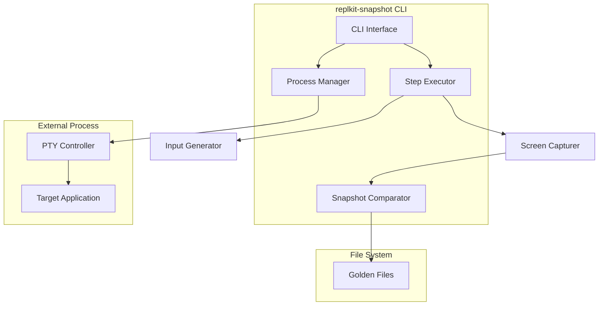
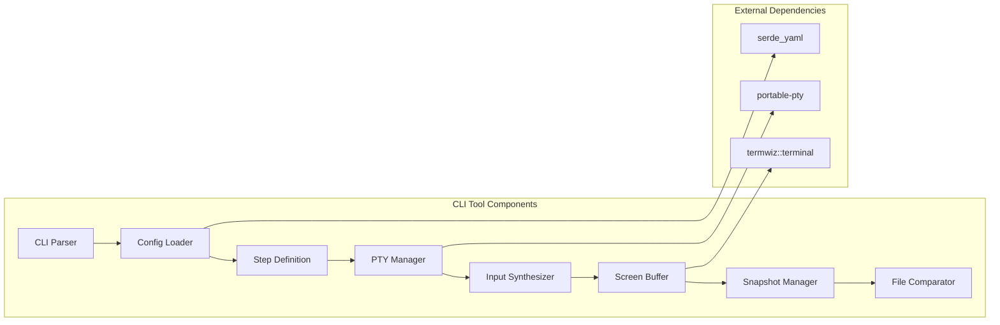

# Design Document — `replkit-snapshot`

## Overview

This design outlines `replkit-snapshot`, a CLI tool for automated snapshot testing of terminal-based applications built with replkit. The tool uses PTY-based execution to run applications in controlled terminal environments and compares their output with golden snapshots. This enables cross-language binding validation and regression detection for interactive applications built with replkit.

## Tool Architecture

### High-Level Architecture



### Component Architecture



## Components and Interfaces

### 1. CLI Parser and Configuration

The main entry point that handles command line arguments and configuration loading.

```rust
use clap::{Parser, Subcommand};
use serde::{Deserialize, Serialize};

#[derive(Parser)]
#[command(name = "replkit-snapshot")]
#[command(about = "Snapshot testing tool for terminal applications")]
pub struct Cli {
    #[command(subcommand)]
    pub command: Commands,
}

#[derive(Subcommand)]
pub enum Commands {
    Run {
        /// Command to execute
        #[arg(long)]
        cmd: String,
        
        /// Working directory
        #[arg(long)]
        workdir: Option<PathBuf>,
        
        /// Environment variables (KEY=VALUE)
        #[arg(long = "env")]
        env_vars: Vec<String>,
        
        /// Terminal window size (COLSxROWS)
        #[arg(long, default_value = "80x24")]
        winsize: String,
        
        /// Step definition file
        #[arg(long)]
        steps: PathBuf,
        
        /// Snapshot directory
        #[arg(long)]
        compare: PathBuf,
        
        /// Update golden snapshots
        #[arg(long)]
        update: bool,
        
        /// Global timeout
        #[arg(long, default_value = "30s")]
        timeout: String,
        
        /// Strip ANSI codes
        #[arg(long, default_value = "true")]
        strip_ansi: bool,
    },
}

#[derive(Debug, Deserialize, Serialize)]
pub struct StepDefinition {
    pub version: u32,
    pub command: CommandConfig,
    pub tty: TtyConfig,
    pub steps: Vec<Step>,
}

#[derive(Debug, Deserialize, Serialize)]
pub struct CommandConfig {
    pub exec: Vec<String>,
    pub workdir: Option<PathBuf>,
    pub env: Option<HashMap<String, String>>,
}

#[derive(Debug, Deserialize, Serialize)]
pub struct TtyConfig {
    pub cols: u16,
    pub rows: u16,
}
```

### 2. PTY Manager and Process Control

Manages the pseudo-terminal and target application lifecycle.

```rust
use portable_pty::{PtySize, CommandBuilder, PtyPair};
use std::process::{Child, Stdio};
use std::io::{Read, Write};

pub struct PtyManager {
    pty_pair: PtyPair,
    child_process: Option<Child>,
    reader: Box<dyn Read + Send>,
    writer: Box<dyn Write + Send>,
    terminal_size: PtySize,
}

impl PtyManager {
    pub fn new(cols: u16, rows: u16) -> Result<Self, PtyError> {
        let pty_system = portable_pty::native_pty_system();
        let terminal_size = PtySize {
            cols: cols,
            rows: rows,
            pixel_width: 0,
            pixel_height: 0,
        };
        
        let pty_pair = pty_system.openpty(terminal_size)?;
        let reader = pty_pair.master.try_clone_reader()?;
        let writer = pty_pair.master.try_clone_writer()?;
        
        Ok(Self {
            pty_pair,
            child_process: None,
            reader,
            writer,
            terminal_size,
        })
    }
    
    pub fn spawn_command(&mut self, cmd: &CommandConfig) -> Result<(), PtyError> {
        let mut command = CommandBuilder::new(&cmd.exec[0]);
        
        for arg in &cmd.exec[1..] {
            command.arg(arg);
        }
        
        if let Some(workdir) = &cmd.workdir {
            command.cwd(workdir);
        }
        
        if let Some(env) = &cmd.env {
            for (key, value) in env {
                command.env(key, value);
            }
        }
        
        let child = self.pty_pair.slave.spawn_command(command)?;
        self.child_process = Some(child);
        
        Ok(())
    }
    
    pub fn send_input(&mut self, input: &[u8]) -> Result<(), std::io::Error> {
        self.writer.write_all(input)?;
        self.writer.flush()?;
        Ok(())
    }
    
    pub fn read_output(&mut self, buffer: &mut [u8]) -> Result<usize, std::io::Error> {
        self.reader.read(buffer)
    }
    
    pub fn is_process_running(&mut self) -> bool {
        match &mut self.child_process {
            Some(child) => child.try_wait().unwrap_or(None).is_none(),
            None => false,
        }
    }
}
```

### 3. Step Execution Engine

Executes test steps defined in the configuration file.

```rust
use serde::{Deserialize, Serialize};
use std::time::Duration;

#[derive(Debug, Deserialize, Serialize)]
#[serde(untagged)]
pub enum Step {
    Send { send: InputSpec },
    WaitIdle { waitIdle: String },
    WaitRegex { waitForRegex: String },
    WaitExit { waitExit: String },
    Snapshot { snapshot: SnapshotConfig },
    Sleep { sleep: String },
}

#[derive(Debug, Deserialize, Serialize)]
#[serde(untagged)]
pub enum InputSpec {
    Text(String),
    Keys(Vec<String>),
}

#[derive(Debug, Deserialize, Serialize)]
pub struct SnapshotConfig {
    pub name: String,
    #[serde(default = "default_strip_ansi")]
    pub stripAnsi: bool,
    pub mask: Option<Vec<String>>,
}

fn default_strip_ansi() -> bool { true }

pub struct StepExecutor {
    pty_manager: PtyManager,
    screen_capturer: ScreenCapturer,
}

impl StepExecutor {
    pub fn new(pty_manager: PtyManager, screen_capturer: ScreenCapturer) -> Self {
        Self {
            pty_manager,
            screen_capturer,
        }
    }
    
    pub async fn execute_steps(&mut self, steps: &[Step]) -> Result<Vec<Snapshot>, ExecutionError> {
        let mut snapshots = Vec::new();
        
        for step in steps {
            match step {
                Step::Send { send } => self.execute_send(send).await?,
                Step::WaitIdle { waitIdle } => self.execute_wait_idle(waitIdle).await?,
                Step::WaitRegex { waitForRegex } => self.execute_wait_regex(waitForRegex).await?,
                Step::WaitExit { waitExit } => self.execute_wait_exit(waitExit).await?,
                Step::Snapshot { snapshot } => {
                    let snap = self.capture_snapshot(snapshot).await?;
                    snapshots.push(snap);
                },
                Step::Sleep { sleep } => self.execute_sleep(sleep).await?,
            }
        }
        
        Ok(snapshots)
    }
    
    async fn execute_send(&mut self, input: &InputSpec) -> Result<(), ExecutionError> {
        let bytes = match input {
            InputSpec::Text(text) => text.as_bytes().to_vec(),
            InputSpec::Keys(keys) => self.convert_keys_to_bytes(keys)?,
        };
        
        self.pty_manager.send_input(&bytes)?;
        Ok(())
    }
    
    fn convert_keys_to_bytes(&self, keys: &[String]) -> Result<Vec<u8>, ExecutionError> {
        let mut bytes = Vec::new();
        
        for key in keys {
            match key.as_str() {
                "Tab" => bytes.push(0x09),
                "Enter" => bytes.push(0x0D),
                "Esc" => bytes.push(0x1B),
                "Left" => bytes.extend_from_slice(b"\x1B[D"),
                "Right" => bytes.extend_from_slice(b"\x1B[C"),
                "Up" => bytes.extend_from_slice(b"\x1B[A"),
                "Down" => bytes.extend_from_slice(b"\x1B[B"),
                "Ctrl+C" => bytes.push(0x03),
                "Ctrl+D" => bytes.push(0x04),
                _ if key.starts_with("Ctrl+") => {
                    let ch = key.chars().last().unwrap().to_ascii_uppercase();
                    let ctrl_code = (ch as u8) - b'A' + 1;
                    bytes.push(ctrl_code);
                },
                _ => return Err(ExecutionError::InvalidKey(key.clone())),
            }
        }
        
        Ok(bytes)
    }
}
```

### 4. Screen Capture and Snapshot Management

Captures terminal output and manages snapshot comparison.

```rust
use termwiz::terminal::Terminal;
use std::fs;
use std::path::Path;

pub struct ScreenCapturer {
    terminal: Terminal,
    strip_ansi: bool,
}

#[derive(Debug, Clone)]
pub struct Snapshot {
    pub name: String,
    pub content: String,
    pub timestamp: std::time::SystemTime,
}

impl ScreenCapturer {
    pub fn new(cols: u16, rows: u16, strip_ansi: bool) -> Self {
        let terminal = Terminal::new_with_size(cols as usize, rows as usize);
        Self {
            terminal,
            strip_ansi,
        }
    }
    
    pub fn capture_screen(&mut self, pty_output: &[u8]) -> Result<String, CaptureError> {
        // Feed the output to terminal emulator
        self.terminal.advance_bytes(pty_output);
        
        // Get the rendered screen
        let mut content = self.terminal.get_screen_and_logs_as_text();
        
        if self.strip_ansi {
            content = self.strip_ansi_codes(&content);
        }
        
        // Normalize content
        content = self.normalize_content(&content);
        
        Ok(content)
    }
    
    fn strip_ansi_codes(&self, text: &str) -> String {
        // Simple ANSI stripping - in real implementation use a proper library
        let re = regex::Regex::new(r"\x1b\[[0-9;]*[a-zA-Z]").unwrap();
        re.replace_all(text, "").to_string()
    }
    
    fn normalize_content(&self, text: &str) -> String {
        text.lines()
            .map(|line| line.trim_end())
            .collect::<Vec<_>>()
            .join("\n")
    }
}

pub struct SnapshotComparator {
    snapshot_dir: PathBuf,
    update_mode: bool,
}

impl SnapshotComparator {
    pub fn new(snapshot_dir: PathBuf, update_mode: bool) -> Self {
        Self {
            snapshot_dir,
            update_mode,
        }
    }
    
    pub fn compare_or_update(&self, snapshot: &Snapshot) -> Result<ComparisonResult, CompareError> {
        let snapshot_path = self.snapshot_dir.join(format!("{}.snap.txt", snapshot.name));
        
        if self.update_mode {
            fs::write(&snapshot_path, &snapshot.content)?;
            return Ok(ComparisonResult::Updated);
        }
        
        if !snapshot_path.exists() {
            return Ok(ComparisonResult::Missing);
        }
        
        let expected = fs::read_to_string(&snapshot_path)?;
        
        if expected == snapshot.content {
            Ok(ComparisonResult::Match)
        } else {
            Ok(ComparisonResult::Mismatch {
                expected,
                actual: snapshot.content.clone(),
                diff: self.compute_diff(&expected, &snapshot.content),
            })
        }
    }
    
    fn compute_diff(&self, expected: &str, actual: &str) -> String {
        // Simple unified diff - in real implementation use a proper diff library
        format!("--- expected\n+++ actual\n{}", 
               self.simple_diff(expected, actual))
    }
    
    fn simple_diff(&self, expected: &str, actual: &str) -> String {
        let expected_lines: Vec<&str> = expected.lines().collect();
        let actual_lines: Vec<&str> = actual.lines().collect();
        
        let mut diff = String::new();
        let max_lines = expected_lines.len().max(actual_lines.len());
        
        for i in 0..max_lines {
            let exp_line = expected_lines.get(i).unwrap_or(&"");
            let act_line = actual_lines.get(i).unwrap_or(&"");
            
            if exp_line != act_line {
                diff.push_str(&format!("-{}\n+{}\n", exp_line, act_line));
            }
        }
        
        diff
    }
}

#[derive(Debug)]
pub enum ComparisonResult {
    Match,
    Mismatch { expected: String, actual: String, diff: String },
    Missing,
    Updated,
}
```

### 5. Cross-Language Validation

Tools for ensuring consistent behavior across different language bindings.

```rust
pub struct CrossLanguageValidator {
    test_cases: HashMap<String, TestCase>,
}

#[derive(Debug, Clone)]
pub struct TestCase {
    pub name: String,
    pub description: String,
    pub step_file: PathBuf,
    pub language_configs: HashMap<String, LanguageConfig>,
}

#[derive(Debug, Clone)]
pub struct LanguageConfig {
    pub command: CommandConfig,
    pub expected_behavior: ExpectedBehavior,
}

#[derive(Debug, Clone)]
pub struct ExpectedBehavior {
    pub should_match_reference: bool,
    pub allowed_differences: Vec<String>,
}

impl CrossLanguageValidator {
    pub fn new() -> Self {
        Self {
            test_cases: HashMap::new(),
        }
    }
    
    pub fn load_test_cases<P: AsRef<Path>>(&mut self, test_dir: P) -> Result<(), ValidatorError> {
        let entries = fs::read_dir(test_dir)?;
        
        for entry in entries {
            let entry = entry?;
            let path = entry.path();
            
            if path.extension().and_then(|s| s.to_str()) == Some("yaml") {
                let test_case: TestCase = serde_yaml::from_str(&fs::read_to_string(&path)?)?;
                self.test_cases.insert(test_case.name.clone(), test_case);
            }
        }
        
        Ok(())
    }
    
    pub async fn validate_cross_language(
        &self,
        test_case_name: &str,
    ) -> Result<ValidationReport, ValidatorError> {
        let test_case = self.test_cases.get(test_case_name)
            .ok_or_else(|| ValidatorError::TestCaseNotFound(test_case_name.to_string()))?;
        
        let mut results = HashMap::new();
        
        for (language, config) in &test_case.language_configs {
            let snapshot_result = self.run_test_for_language(test_case, language, config).await?;
            results.insert(language.clone(), snapshot_result);
        }
        
        Ok(ValidationReport {
            test_case: test_case.name.clone(),
            language_results: results,
            consistency_check: self.check_consistency(&results),
        })
    }
    
    async fn run_test_for_language(
        &self,
        test_case: &TestCase,
        language: &str,
        config: &LanguageConfig,
    ) -> Result<LanguageTestResult, ValidatorError> {
        // Create PTY manager for this language
        let mut pty_manager = PtyManager::new(80, 24)?;
        pty_manager.spawn_command(&config.command)?;
        
        // Load and execute steps
        let step_definition: StepDefinition = serde_yaml::from_str(
            &fs::read_to_string(&test_case.step_file)?
        )?;
        
        let screen_capturer = ScreenCapturer::new(80, 24, true);
        let mut executor = StepExecutor::new(pty_manager, screen_capturer);
        
        let snapshots = executor.execute_steps(&step_definition.steps).await?;
        
        Ok(LanguageTestResult {
            language: language.to_string(),
            snapshots,
            success: true,
        })
    }
    
    fn check_consistency(&self, results: &HashMap<String, LanguageTestResult>) -> ConsistencyReport {
        if results.len() < 2 {
            return ConsistencyReport { consistent: true, differences: Vec::new() };
        }
        
        let languages: Vec<&String> = results.keys().collect();
        let reference_lang = languages[0];
        let reference_snapshots = &results[reference_lang].snapshots;
        
        let mut differences = Vec::new();
        
        for lang in &languages[1..] {
            let lang_snapshots = &results[*lang].snapshots;
            
            for (i, (ref_snap, lang_snap)) in reference_snapshots.iter()
                .zip(lang_snapshots.iter()).enumerate() {
                
                if ref_snap.content != lang_snap.content {
                    differences.push(ConsistencyDifference {
                        snapshot_index: i,
                        reference_language: reference_lang.clone(),
                        other_language: (*lang).clone(),
                        difference_summary: format!(
                            "Content differs between {} and {}",
                            reference_lang, lang
                        ),
                    });
                }
            }
        }
        
        ConsistencyReport {
            consistent: differences.is_empty(),
            differences,
        }
    }
}

#[derive(Debug)]
pub struct ValidationReport {
    pub test_case: String,
    pub language_results: HashMap<String, LanguageTestResult>,
    pub consistency_check: ConsistencyReport,
}

#[derive(Debug)]
pub struct LanguageTestResult {
    pub language: String,
    pub snapshots: Vec<Snapshot>,
    pub success: bool,
}

#[derive(Debug)]
pub struct ConsistencyReport {
    pub consistent: bool,
    pub differences: Vec<ConsistencyDifference>,
}

#[derive(Debug)]
pub struct ConsistencyDifference {
    pub snapshot_index: usize,
    pub reference_language: String,
    pub other_language: String,
    pub difference_summary: String,
}
```

## Data Models

### Main Application State

```rust
#[derive(Debug)]
pub struct SnapshotTestRunner {
    pub config: RunConfig,
    pub pty_manager: Option<PtyManager>,
    pub step_executor: Option<StepExecutor>,
    pub snapshot_comparator: SnapshotComparator,
}

#[derive(Debug, Clone)]
pub struct RunConfig {
    pub command: CommandConfig,
    pub working_directory: Option<PathBuf>,
    pub environment: HashMap<String, String>,
    pub terminal_size: (u16, u16),
    pub timeout: Duration,
    pub update_snapshots: bool,
    pub strip_ansi: bool,
    pub snapshot_directory: PathBuf,
}

impl RunConfig {
    pub fn from_cli_args(args: &Commands) -> Result<Self, ConfigError> {
        match args {
            Commands::Run {
                cmd,
                workdir,
                env_vars,
                winsize,
                steps: _,
                compare,
                update,
                timeout,
                strip_ansi,
            } => {
                let (cols, rows) = Self::parse_window_size(winsize)?;
                let environment = Self::parse_env_vars(env_vars)?;
                let timeout_duration = Self::parse_duration(timeout)?;
                
                Ok(Self {
                    command: CommandConfig {
                        exec: cmd.split_whitespace().map(|s| s.to_string()).collect(),
                        workdir: workdir.clone(),
                        env: if environment.is_empty() { None } else { Some(environment.clone()) },
                    },
                    working_directory: workdir.clone(),
                    environment,
                    terminal_size: (cols, rows),
                    timeout: timeout_duration,
                    update_snapshots: *update,
                    strip_ansi: *strip_ansi,
                    snapshot_directory: compare.clone(),
                })
            }
        }
    }
    
    fn parse_window_size(winsize: &str) -> Result<(u16, u16), ConfigError> {
        let parts: Vec<&str> = winsize.split('x').collect();
        if parts.len() != 2 {
            return Err(ConfigError::InvalidWindowSize(winsize.to_string()));
        }
        
        let cols = parts[0].parse::<u16>()
            .map_err(|_| ConfigError::InvalidWindowSize(winsize.to_string()))?;
        let rows = parts[1].parse::<u16>()
            .map_err(|_| ConfigError::InvalidWindowSize(winsize.to_string()))?;
        
        Ok((cols, rows))
    }
    
    fn parse_env_vars(env_vars: &[String]) -> Result<HashMap<String, String>, ConfigError> {
        let mut env = HashMap::new();
        
        for var in env_vars {
            let parts: Vec<&str> = var.splitn(2, '=').collect();
            if parts.len() != 2 {
                return Err(ConfigError::InvalidEnvironmentVariable(var.clone()));
            }
            env.insert(parts[0].to_string(), parts[1].to_string());
        }
        
        Ok(env)
    }
    
    fn parse_duration(duration_str: &str) -> Result<Duration, ConfigError> {
        // Simple duration parsing - in real implementation use a proper parser
        if duration_str.ends_with('s') {
            let seconds = duration_str.trim_end_matches('s').parse::<u64>()
                .map_err(|_| ConfigError::InvalidDuration(duration_str.to_string()))?;
            Ok(Duration::from_secs(seconds))
        } else if duration_str.ends_with("ms") {
            let millis = duration_str.trim_end_matches("ms").parse::<u64>()
                .map_err(|_| ConfigError::InvalidDuration(duration_str.to_string()))?;
            Ok(Duration::from_millis(millis))
        } else {
            Err(ConfigError::InvalidDuration(duration_str.to_string()))
        }
    }
}
```

## Error Handling

```rust
#[derive(Debug, thiserror::Error)]
pub enum TestError {
    #[error("Terminal emulation error: {0}")]
    TerminalError(String),
    
    #[error("Snapshot comparison failed: {0}")]
    SnapshotError(String),
    
    #[error("Compatibility validation failed: {0}")]
    CompatibilityError(String),
    
    #[error("Test setup error: {0}")]
    SetupError(String),
}

pub type TestResult<T> = Result<T, TestError>;
```

## Testing Strategy

### Integration Tests

Test the complete rendering pipeline:

```rust
#[cfg(test)]
mod integration_tests {
    use super::*;

    #[test]
    fn test_basic_prompt_rendering() {
        let mut test_renderer = TestRenderer::new();
        let document = Document::with_text("hello world".to_string(), 5);
        
        test_renderer.renderer.render_prompt("$ ", &document).unwrap();
        
        // Validate operations
        assert_operations!(test_renderer, [
            ConsoleOperation::MoveCursor { row: 0, col: 0 },
            ConsoleOperation::Clear { clear_type: ClearType::CurrentLine },
            ConsoleOperation::SetStyle { /* green bold style */ },
            ConsoleOperation::WriteText { text: "$ ".to_string() },
            ConsoleOperation::ResetStyle,
            ConsoleOperation::WriteText { text: "hello world".to_string() },
            ConsoleOperation::MoveCursor { row: 0, col: 7 }, // "$ hello|"
            ConsoleOperation::Flush,
        ]);
        
        // Validate terminal state
        test_renderer.assert_cursor_at(0, 7);
        test_renderer.assert_line_contains(0, "$ hello world");
    }

    #[test]
    fn test_completion_menu_rendering() {
        let mut test_renderer = TestRenderer::new();
        let suggestions = vec![
            Suggestion::new("help", "Show help"),
            Suggestion::new("quit", "Exit app"),
        ];
        
        test_renderer.renderer.render_completions(&suggestions).unwrap();
        
        // Validate completion menu appears
        test_renderer.assert_line_contains(1, "help");
        test_renderer.assert_line_contains(2, "quit");
        
        // Snapshot test
        let snapshot = SnapshotManager::new("completion_menu");
        snapshot.assert_terminal_snapshot(&test_renderer);
    }
}
```

This tool will enable confident development and refactoring of replkit by ensuring consistent behavior across all language bindings through automated snapshot testing. See `tasks.md` for detailed implementation roadmap.

## Dependencies and Requirements

### Core Dependencies
- `clap` - CLI argument parsing
- `serde` + `serde_yaml` - Configuration serialization
- `portable-pty` - Cross-platform PTY management
- `termwiz` - Terminal emulation and screen capture
- `tokio` - Async runtime for timeouts and I/O
- `thiserror` - Structured error handling
- `regex` - Pattern matching for wait conditions

### Development Dependencies
- `tempfile` - Temporary files for testing
- `assert_cmd` - CLI testing utilities
- `predicates` - Test assertions
- `mockall` - Mocking for unit tests

### Optional Dependencies
- `tracing` - Structured logging and diagnostics
- `serde_json` - JSON output format support
- `colored` - Colored terminal output
- `indicatif` - Progress bars and spinners
