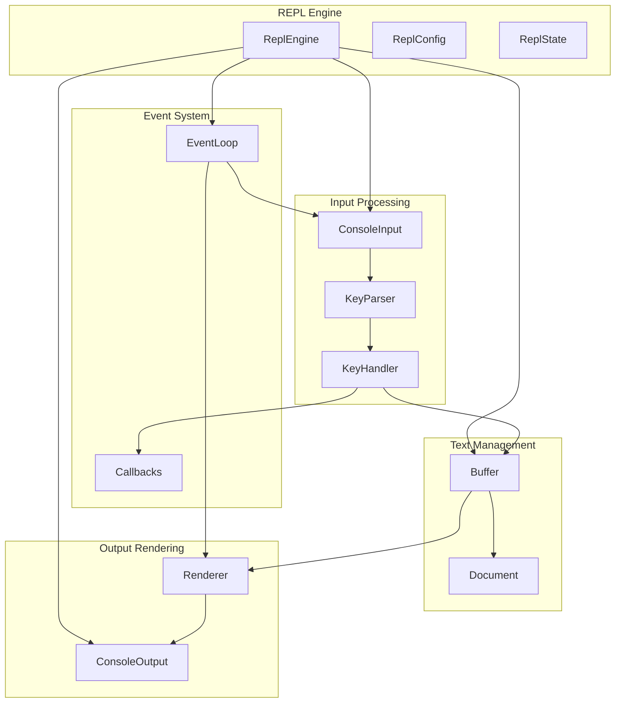
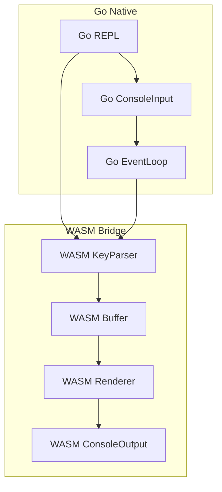

# Design Document

## Overview

The Basic REPL Integration feature creates a cohesive interactive prompt system by connecting the existing ConsoleInput, KeyParser, Buffer, and ConsoleOutput components. The design follows the architecture pattern established by go-prompt, providing a main REPL engine that orchestrates input processing, text editing, and output rendering through a clean event-driven architecture.

The system is designed with cross-platform compatibility in mind, supporting both Rust native implementations and Go bindings through WASM integration. The architecture emphasizes modularity, allowing individual components to be tested and replaced independently while maintaining a consistent API across platforms.

## Architecture

### Core Components



### Data Flow

1. **Input Capture**: ConsoleInput captures raw terminal input and forwards it to KeyParser
2. **Key Processing**: KeyParser converts byte sequences to KeyEvent structures
3. **Event Handling**: KeyHandler processes KeyEvents and updates Buffer state or triggers callbacks
4. **Text Management**: Buffer maintains the current input state and provides Document views
5. **Rendering**: Renderer takes Buffer state and outputs formatted text via ConsoleOutput
6. **Event Loop**: Coordinates the entire process and handles terminal events like resizing

## Components and Interfaces

### ReplEngine

The main orchestrator that manages the REPL lifecycle and coordinates all components.

```rust
pub struct ReplEngine {
    config: ReplConfig,
    state: ReplState,
    console_input: Box<dyn ConsoleInput>,
    console_output: Box<dyn ConsoleOutput>,
    buffer: Buffer,
    key_parser: KeyParser,
    renderer: Renderer,
    event_loop: EventLoop,
}

impl ReplEngine {
    pub fn new(config: ReplConfig) -> Result<Self, ReplError>;
    pub fn run(&mut self) -> Result<(), ReplError>;
    pub fn run_once(&mut self) -> Result<Option<String>, ReplError>;
    pub fn shutdown(&mut self) -> Result<(), ReplError>;
}
```

### ReplConfig

Configuration structure for customizing REPL behavior.

```rust
pub struct ReplConfig {
    pub prompt: String,
    pub executor: Box<dyn Fn(&str) -> Result<(), Box<dyn std::error::Error>> + Send>,
    pub exit_checker: Option<Box<dyn Fn(&str, bool) -> bool + Send>>,
    pub key_bindings: Vec<KeyBinding>,
    pub enable_history: bool,
    pub max_history_size: usize,
    pub enable_multiline: bool,
}

pub struct KeyBinding {
    pub key: Key,
    pub action: KeyAction,
}

pub enum KeyAction {
    MoveCursorLeft(usize),
    MoveCursorRight(usize),
    DeleteBackward(usize),
    DeleteForward(usize),
    Custom(Box<dyn Fn(&mut Buffer) + Send>),
}
```

### ReplState

Internal state management for the REPL engine.

```rust
struct ReplState {
    running: bool,
    should_exit: bool,
    raw_mode_guard: Option<RawModeGuard>,
    window_size: (u16, u16),
    last_render_hash: u64,
}
```

### KeyHandler

Processes key events and translates them into buffer operations or system actions.

```rust
pub struct KeyHandler {
    key_bindings: HashMap<Key, KeyAction>,
    default_bindings: HashMap<Key, KeyAction>,
}

impl KeyHandler {
    pub fn new(custom_bindings: Vec<KeyBinding>) -> Self;
    pub fn handle_key(&self, key: Key, buffer: &mut Buffer) -> KeyResult;
}

pub enum KeyResult {
    Continue,
    Execute(String),
    Exit,
    ClearLine,
}
```

### Renderer

Manages the visual representation of the REPL state.

```rust
pub struct Renderer {
    output: Box<dyn ConsoleOutput>,
    prompt: String,
    last_cursor_pos: usize,
    last_text_hash: u64,
}

impl Renderer {
    pub fn new(output: Box<dyn ConsoleOutput>, prompt: String) -> Self;
    pub fn render(&mut self, buffer: &Buffer) -> Result<(), ReplError>;
    pub fn clear_line(&mut self) -> Result<(), ReplError>;
    pub fn break_line(&mut self) -> Result<(), ReplError>;
    pub fn update_window_size(&mut self, width: u16, height: u16);
}
```

### EventLoop

Coordinates the main REPL event processing loop.

```rust
pub struct EventLoop {
    input: Box<dyn ConsoleInput>,
    running: Arc<AtomicBool>,
    event_sender: mpsc::Sender<ReplEvent>,
    event_receiver: mpsc::Receiver<ReplEvent>,
}

pub enum ReplEvent {
    KeyPressed(KeyEvent),
    WindowResized(u16, u16),
    Shutdown,
}

impl EventLoop {
    pub fn new(input: Box<dyn ConsoleInput>) -> Self;
    pub fn start(&mut self) -> Result<(), ReplError>;
    pub fn stop(&mut self) -> Result<(), ReplError>;
    pub fn next_event(&mut self) -> Result<Option<ReplEvent>, ReplError>;
}
```

## Data Models

### Error Types

```rust
#[derive(Debug)]
pub enum ReplError {
    ConsoleError(ConsoleError),
    ConfigurationError(String),
    EventLoopError(String),
    RenderError(String),
    CallbackError(String),
}

impl From<ConsoleError> for ReplError {
    fn from(err: ConsoleError) -> Self {
        ReplError::ConsoleError(err)
    }
}
```

### Platform Abstraction

```rust
pub trait PlatformFactory {
    fn create_console_input(&self) -> Result<Box<dyn ConsoleInput>, ReplError>;
    fn create_console_output(&self) -> Result<Box<dyn ConsoleOutput>, ReplError>;
}

// Factory for Rust native implementations
pub struct NativePlatformFactory;

// Note: Go bindings use a hybrid approach with native Go ConsoleInput
// and WASM-bridged ConsoleOutput, so they don't use this factory pattern

impl PlatformFactory for NativePlatformFactory {
    fn create_console_input(&self) -> Result<Box<dyn ConsoleInput>, ReplError> {
        #[cfg(unix)]
        return Ok(Box::new(replkit_io::unix::UnixVtConsoleInput::new()?));
        
        #[cfg(windows)]
        {
            // Try VT mode first, fallback to Legacy mode
            if let Ok(vt_input) = replkit_io::windows::WindowsVtConsoleInput::new() {
                return Ok(Box::new(vt_input));
            } else {
                return Ok(Box::new(replkit_io::windows::WindowsLegacyConsoleInput::new()?));
            }
        }
    }
    
    fn create_console_output(&self) -> Result<Box<dyn ConsoleOutput>, ReplError> {
        #[cfg(unix)]
        return Ok(Box::new(replkit_io::unix::UnixVtConsoleOutput::new()?));
        
        #[cfg(windows)]
        {
            // Try VT mode first, fallback to Legacy mode
            if let Ok(vt_output) = replkit_io::windows::WindowsVtConsoleOutput::new() {
                return Ok(Box::new(vt_output));
            } else {
                return Ok(Box::new(replkit_io::windows::WindowsLegacyConsoleOutput::new()?));
            }
        }
    }
}
```

## Error Handling

### Error Recovery Strategy

1. **Console I/O Errors**: Attempt to reinitialize console components and continue
2. **Terminal State Corruption**: Force terminal reset and restore raw mode
3. **Callback Exceptions**: Catch and log errors, continue REPL operation
4. **Memory Allocation**: Graceful degradation with reduced functionality
5. **Terminal Disconnection**: Clean shutdown with resource cleanup

### Error Propagation

```rust
impl ReplEngine {
    fn handle_error(&mut self, error: ReplError) -> Result<(), ReplError> {
        match error {
            ReplError::ConsoleError(ConsoleError::IoError(_)) => {
                // Attempt to reinitialize console
                self.reinitialize_console()?;
                Ok(())
            }
            ReplError::CallbackError(msg) => {
                // Log error and continue
                eprintln!("Callback error: {}", msg);
                Ok(())
            }
            _ => Err(error), // Propagate unrecoverable errors
        }
    }
}
```

## Testing Strategy

### Unit Testing

- **Component Isolation**: Test each component (KeyHandler, Renderer, EventLoop) independently
- **Mock Dependencies**: Use mock ConsoleInput/Output for deterministic testing
- **Error Conditions**: Test error handling and recovery scenarios
- **Configuration Validation**: Test various configuration combinations

### Integration Testing

- **End-to-End Workflows**: Test complete REPL sessions with simulated input
- **Cross-Platform Compatibility**: Validate behavior across Unix and Windows
- **Performance Testing**: Measure latency and throughput under load
- **Memory Testing**: Verify no memory leaks during extended operation

### Test Infrastructure

```rust
pub struct MockReplTest {
    input_queue: VecDeque<KeyEvent>,
    output_capture: Vec<String>,
    repl: ReplEngine,
}

impl MockReplTest {
    pub fn new(config: ReplConfig) -> Self;
    pub fn send_keys(&mut self, keys: &[Key]);
    pub fn send_text(&mut self, text: &str);
    pub fn expect_output(&self, expected: &str) -> bool;
    pub fn run_until_complete(&mut self) -> Result<String, ReplError>;
}

#[cfg(test)]
mod tests {
    use super::*;
    
    #[test]
    fn test_basic_input_output() {
        let config = ReplConfig::default();
        let mut test = MockReplTest::new(config);
        
        test.send_text("hello world");
        test.send_keys(&[Key::Enter]);
        
        let result = test.run_until_complete().unwrap();
        assert_eq!(result, "hello world");
        assert!(test.expect_output(">>> hello world\n"));
    }
}
```

## Go Binding Design (Hybrid Approach)

### Architecture Overview

The Go bindings use a hybrid approach where ConsoleInput is implemented natively in Go (for low-level terminal access), while ConsoleOutput, KeyParser, Buffer, and Renderer are accessed through WASM. This design addresses the limitation that low-level APIs like termios, sigwinch, and non-blocking reads cannot be effectively bridged through WASM.



### Go Interface

```go
package replkit

import (
    "context"
    "github.com/tetratelabs/wazero"
    "github.com/tetratelabs/wazero/api"
)

type Repl struct {
    // Native Go components
    consoleInput  ConsoleInput
    eventLoop     *EventLoop
    
    // WASM components
    wasmRuntime   wazero.Runtime
    wasmModule    api.Module
    keyParser     *WasmKeyParser
    buffer        *WasmBuffer
    renderer      *WasmRenderer
    
    // Configuration
    config        Config
    running       bool
}

type Config struct {
    Prompt      string
    Executor    func(string) error
    ExitChecker func(string, bool) bool
    KeyBindings []KeyBinding
}

// Native Go ConsoleInput interface
type ConsoleInput interface {
    EnableRawMode() (RawModeGuard, error)
    GetWindowSize() (uint16, uint16, error)
    StartEventLoop() error
    StopEventLoop() error
    OnWindowResize(callback func(uint16, uint16))
    OnKeyPressed(callback func([]byte))
    IsRunning() bool
}

// Constructor function that returns appropriate implementation based on build tags
func NewConsoleInput() ConsoleInput

// Platform-specific implementations (internal)
type consoleInput struct {
    // Platform-specific fields populated by build tags
}

func NewRepl(config Config) (*Repl, error)
func (r *Repl) Run() error
func (r *Repl) RunOnce() (string, error)
func (r *Repl) Shutdown() error
```

### Native Go ConsoleInput Implementation

```go
// console_input.go (common interface and constructor)
package replkit

// Constructor that returns platform-appropriate implementation
func NewConsoleInput() ConsoleInput {
    return &consoleInput{}
}

// console_input_unix.go
// +build !windows

package replkit

import (
    "os"
    "os/signal"
    "syscall"
    "golang.org/x/sys/unix"
)

type consoleInput struct {
    originalTermios *unix.Termios
    rawModeActive   bool
    eventChan       chan []byte
    resizeChan      chan os.Signal
    stopChan        chan struct{}
    running         bool
    
    keyCallback    func([]byte)
    resizeCallback func(uint16, uint16)
}

func (c *consoleInput) EnableRawMode() (RawModeGuard, error) {
    // Save original termios
    termios, err := unix.IoctlGetTermios(int(os.Stdin.Fd()), unix.TCGETS)
    if err != nil {
        return nil, err
    }
    u.originalTermios = termios
    
    // Set raw mode
    rawTermios := *termios
    rawTermios.Lflag &^= unix.ECHO | unix.ICANON | unix.ISIG | unix.IEXTEN
    rawTermios.Iflag &^= unix.IXON | unix.ICRNL
    rawTermios.Cc[unix.VMIN] = 1
    rawTermios.Cc[unix.VTIME] = 0
    
    if err := unix.IoctlSetTermios(int(os.Stdin.Fd()), unix.TCSETS, &rawTermios); err != nil {
        return nil, err
    }
    
    c.rawModeActive = true
    return &GoRawModeGuard{input: c}, nil
}

func (c *consoleInput) StartEventLoop() error {
    if c.running {
        return fmt.Errorf("event loop already running")
    }
    
    c.running = true
    signal.Notify(c.resizeChan, syscall.SIGWINCH)
    
    go c.readLoop()
    go c.eventLoop()
    
    return nil
}

func (u *UnixConsoleInput) readLoop() {
    buffer := make([]byte, 256)
    for u.running {
        n, err := syscall.Read(int(os.Stdin.Fd()), buffer)
        if err != nil {
            if err == syscall.EAGAIN || err == syscall.EWOULDBLOCK {
                continue
            }
            break
        }
        if n > 0 {
            data := make([]byte, n)
            copy(data, buffer[:n])
            select {
            case u.eventChan <- data:
            case <-u.stopChan:
                return
            }
        }
    }
}

func (c *consoleInput) eventLoop() {
    for c.running {
        select {
        case data := <-c.eventChan:
            if c.keyCallback != nil {
                c.keyCallback(data)
            }
        case <-c.resizeChan:
            if c.resizeCallback != nil {
                cols, rows, _ := c.GetWindowSize()
                c.resizeCallback(cols, rows)
            }
        case <-c.stopChan:
            return
        }
    }
}

// console_input_windows.go
// +build windows

package replkit

import (
    "syscall"
    "unsafe"
    tty "github.com/mattn/go-tty"
)

type consoleInput struct {
    tty            *tty.TTY
    running        bool
    stopChan       chan struct{}
    eventChan      chan []byte
    
    keyCallback    func([]byte)
    resizeCallback func(uint16, uint16)
}

func (c *consoleInput) EnableRawMode() (RawModeGuard, error) {
    t, err := tty.Open()
    if err != nil {
        return nil, err
    }
    c.tty = t
    return &GoRawModeGuard{input: c}, nil
}

func (c *consoleInput) StartEventLoop() error {
    if c.running {
        return fmt.Errorf("event loop already running")
    }
    
    c.running = true
    c.stopChan = make(chan struct{})
    c.eventChan = make(chan []byte, 128)
    
    go c.readLoop()
    go c.eventLoop()
    
    return nil
}
```

### WASM Bridge Protocol

The WASM bridge handles the text processing and rendering components:

```rust
// WASM exports for Go integration
#[wasm_bindgen]
pub fn repl_create_components(config_json: &str) -> Result<u32, JsValue>;

#[wasm_bindgen]
pub fn repl_process_key_input(repl_id: u32, key_data: &[u8]) -> Result<String, JsValue>;

#[wasm_bindgen]
pub fn repl_render_buffer(repl_id: u32) -> Result<String, JsValue>;

#[wasm_bindgen]
pub fn repl_handle_resize(repl_id: u32, cols: u16, rows: u16) -> Result<(), JsValue>;

#[wasm_bindgen]
pub fn repl_destroy_components(repl_id: u32) -> Result<(), JsValue>;

// JSON Protocol for configuration and state
#[derive(Serialize, Deserialize)]
pub struct WasmReplConfig {
    pub prompt: String,
    pub key_bindings: Vec<WasmKeyBinding>,
}

#[derive(Serialize, Deserialize)]
pub enum WasmReplEvent {
    Continue,
    Execute(String),
    Exit,
    ClearLine,
    Error(String),
}

#[derive(Serialize, Deserialize)]
pub struct WasmRenderOutput {
    pub output_commands: Vec<OutputCommand>,
    pub cursor_position: (u16, u16),
}

#[derive(Serialize, Deserialize)]
pub enum OutputCommand {
    WriteText(String),
    MoveCursor(u16, u16),
    ClearLine,
    SetStyle(TextStyle),
}
```

### Go-WASM Integration

```go
type WasmKeyParser struct {
    module   api.Module
    instance uint32
}

func (w *WasmKeyParser) ProcessInput(data []byte) (ReplEvent, error) {
    results, err := w.module.ExportedFunction("repl_process_key_input").Call(
        context.Background(),
        uint64(w.instance),
        uint64(uintptr(unsafe.Pointer(&data[0]))),
        uint64(len(data)),
    )
    if err != nil {
        return ReplEvent{}, err
    }
    
    // Parse JSON result
    var event WasmReplEvent
    if err := json.Unmarshal([]byte(results[0]), &event); err != nil {
        return ReplEvent{}, err
    }
    
    return convertWasmEvent(event), nil
}

type WasmRenderer struct {
    module   api.Module
    instance uint32
    output   ConsoleOutput // Native Go ConsoleOutput implementation
}

func (w *WasmRenderer) Render() error {
    results, err := w.module.ExportedFunction("repl_render_buffer").Call(
        context.Background(),
        uint64(w.instance),
    )
    if err != nil {
        return err
    }
    
    // Parse render commands
    var renderOutput WasmRenderOutput
    if err := json.Unmarshal([]byte(results[0]), &renderOutput); err != nil {
        return err
    }
    
    // Execute commands through native Go ConsoleOutput
    for _, cmd := range renderOutput.OutputCommands {
        if err := w.executeOutputCommand(cmd); err != nil {
            return err
        }
    }
    
    return nil
}
```

## Performance Considerations

### Rendering Optimization

- **Differential Updates**: Only redraw changed portions of the display
- **Cursor Tracking**: Minimize cursor movement commands
- **Buffer Batching**: Batch multiple output operations before flushing

### Memory Management

- **Buffer Reuse**: Reuse string buffers for rendering operations
- **Event Pool**: Pool KeyEvent objects to reduce allocations
- **Lazy Initialization**: Initialize expensive components only when needed

### Latency Optimization

- **Direct Key Mapping**: Fast path for common key operations
- **Minimal Validation**: Defer expensive validation until necessary
- **Async I/O**: Use non-blocking I/O where possible

## Security Considerations

### Input Sanitization

- **Control Sequence Filtering**: Remove potentially dangerous escape sequences
- **Buffer Overflow Protection**: Limit input buffer sizes
- **Unicode Validation**: Ensure all text input is valid UTF-8

### Resource Limits

- **Memory Limits**: Prevent unbounded memory growth
- **CPU Limits**: Prevent infinite loops in user callbacks
- **File Descriptor Limits**: Properly manage system resources

## Deployment and Integration

### Rust Integration

```rust
use replkit_core::repl::{ReplEngine, ReplConfig};

fn main() -> Result<(), Box<dyn std::error::Error>> {
    let config = ReplConfig {
        prompt: ">>> ".to_string(),
        executor: Box::new(|input| {
            println!("You entered: {}", input);
            Ok(())
        }),
        ..Default::default()
    };
    
    let mut repl = ReplEngine::new(config)?;
    repl.run()?;
    Ok(())
}
```

### Go Integration

```go
package main

import (
    "fmt"
    "github.com/your-org/replkit-go"
)

func main() {
    config := replkit.Config{
        Prompt: ">>> ",
        Executor: func(input string) error {
            fmt.Printf("You entered: %s\n", input)
            return nil
        },
    }
    
    repl, err := replkit.NewRepl(config)
    if err != nil {
        panic(err)
    }
    defer repl.Shutdown()
    
    if err := repl.Run(); err != nil {
        panic(err)
    }
}
```

## Implementation Notes

### Go ConsoleInput Requirements

The Go ConsoleInput implementation needs to handle:

1. **Raw Mode Management**: Using golang.org/x/sys/unix for termios manipulation
2. **Non-blocking I/O**: Proper handling of EAGAIN/EWOULDBLOCK
3. **Signal Handling**: SIGWINCH for window resize detection
4. **Cross-platform Support**: Separate implementations for Unix and Windows
5. **Resource Cleanup**: Proper restoration of terminal state on exit

### WASM Bridge Considerations

1. **Memory Management**: Careful handling of byte arrays passed between Go and WASM
2. **Error Propagation**: Converting Rust errors to Go errors through JSON
3. **Performance**: Minimizing serialization overhead for high-frequency operations
4. **State Synchronization**: Ensuring consistent state between Go and WASM components