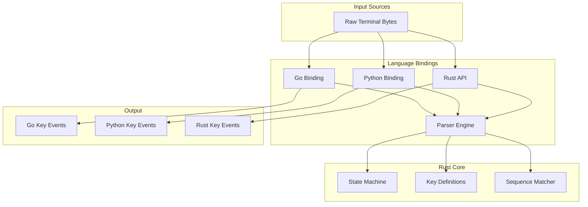

# Design Document

## Overview

The key input parser will be implemented as a Rust core library with a state machine-based parser that can handle partial byte sequences. The design follows a layered architecture with the Rust core providing the parsing engine, and language-specific bindings exposing idiomatic APIs for Go and Python.


## Architecture



## Components and Interfaces

### Core Parser Engine (`replkit-core/src/key_parser.rs`)

The main parser component that implements the state machine logic:

```rust
pub struct KeyParser {
    state: ParserState,
    buffer: Vec<u8>,
    sequence_matcher: SequenceMatcher,
}

impl KeyParser {
    pub fn new() -> Self;
    pub fn feed(&mut self, data: &[u8]) -> Vec<KeyEvent>;
    pub fn flush(&mut self) -> Vec<KeyEvent>;
    pub fn reset(&mut self);
}

enum ParserState {
    Normal,
    EscapeSequence,
    CsiSequence,
    MouseEvent,
    BracketedPaste,
}
```

### Key Definitions (`replkit-core/src/key.rs`)

Comprehensive key type definitions matching go-prompt's structure:

```rust
#[derive(Debug, Clone, Copy, PartialEq, Eq, Hash)]
pub enum Key {
    // Control characters
    ControlA, ControlB, ControlC, /* ... */
    
    // Navigation
    Up, Down, Left, Right,
    Home, End, PageUp, PageDown,
    
    // Function keys
    F1, F2, F3, /* ... */ F24,
    
    // Special keys
    Tab, Enter, Escape, Backspace, Delete,
    
    // Modifier combinations
    ShiftUp, ShiftDown, ShiftLeft, ShiftRight,
    
    // Special sequences
    CPRResponse, Vt100MouseEvent, BracketedPaste,
    
    // Meta
    NotDefined, Ignore,
}

#[derive(Debug, Clone)]
pub struct KeyEvent {
    pub key: Key,
    pub raw_bytes: Vec<u8>,
    pub text: Option<String>,
}
```

### Sequence Matcher (`replkit-core/src/sequence_matcher.rs`)

The SequenceMatcher is responsible for mapping byte sequences to key events and determining if partial sequences could be prefixes of longer valid sequences. This is crucial for the state machine to know whether to wait for more bytes or process what it has.

For example:
- `[0x1b]` (ESC) could be a standalone Escape key OR the start of `[0x1b, 0x5b, 0x41]` (Up arrow)
- `[0x1b, 0x5b]` (ESC[) is definitely a prefix and we must wait for more bytes
- `[0x1b, 0x5b, 0x41]` (ESC[A) is a complete Up arrow sequence

We use a Trie data structure for efficient prefix-aware lookups without allocations:

```rust
#[derive(Debug)]
struct TrieNode {
    key: Option<Key>,           // Some(key) if this node represents a complete sequence
    children: BTreeMap<u8, TrieNode>,
}

#[derive(Debug, Clone, PartialEq)]
pub enum MatchResult {
    Exact(Key),                 // Found exact match
    Prefix,                     // Partial match, could be longer sequence
    NoMatch,                    // No match possible
}

#[derive(Debug, Clone, PartialEq)]
pub struct LongestMatchResult {
    pub key: Key,
    pub consumed_bytes: usize,
}

pub struct SequenceMatcher {
    root: TrieNode,
}
```

API:

```rust
impl SequenceMatcher {
    pub fn new() -> Self;
    
    // Primary API: efficient single-pass matching
    pub fn match_sequence(&self, bytes: &[u8]) -> MatchResult;
    
    // Find longest valid sequence from start of bytes (for fallback processing)
    pub fn find_longest_match(&self, bytes: &[u8]) -> Option<LongestMatchResult>;
    
    // Internal helper to traverse trie
    fn find_node(&self, bytes: &[u8]) -> Option<&TrieNode>;

    // Register a custom sequence
    pub fn insert(&mut self, bytes: &[u8], key: Key);
}
```

**Custom Key Sequences**
The insert method allows dynamically registering custom key sequences, which is useful for implementing features like:

- Vim-style keybindings ("gg", "dd", etc.)
- Terminal-specific escape sequences (e.g., for Ctrl+Arrow keys)
- Internationalized input (e.g., IME support)

This is especially relevant for tools like go-prompt, where developers may want to support complex and customizable input behavior.

Example:

```rust
matcher.insert(b"\x1b[1;5C", Key::CtrlRight);  // Ctrl + Right Arrow
matcher.insert(b"gg", Key::VimGoTop);          // Vim-style "go to top"
```

These sequences can be loaded from user preferences, dotfiles, or application-specific config files, enabling a flexible and extensible replkit experience.

### Go Binding (`bindings/go/` + `crates/replkit-wasm/`)

The Go binding leverages a WebAssembly (WASM) approach instead of CGO. The Rust core parser is compiled into a WASM module located in `crates/replkit-wasm`, which exports functions for key parsing.

The Go code in `bindings/go/` loads and interacts with this WASM module using the [wazero](https://github.com/tetratelabs/wazero) runtime, providing a Go-idiomatic API while avoiding native dependencies.

#### Rust WASM Export (`crates/replkit-wasm/src/lib.rs`)

- Implements `wasm_bindgen` or `wasmtime`-compatible exports exposing the key parsing API
- Functions include creating a parser instance, feeding input bytes, flushing buffers, and resetting state
- Returns serialized key event data (e.g., JSON or binary) consumable by Go

```rust
// Example using wasm_bindgen (or similar)
#[wasm_bindgen]
pub struct WasmKeyParser {
    inner: replkit_core::KeyParser,
}

#[wasm_bindgen]
impl WasmKeyParser {
    #[wasm_bindgen(constructor)]
    pub fn new() -> WasmKeyParser {
        WasmKeyParser { inner: replkit_core::KeyParser::new() }
    }

    pub fn feed(&mut self, data: &[u8]) -> JsValue {
        let events = self.inner.feed(data);
        // Serialize events to JsValue (e.g., JSON)
        JsValue::from_serde(&events).unwrap()
    }

    pub fn flush(&mut self) -> JsValue { /* ... */ }
    pub fn reset(&mut self) { /* ... */ }
}
```

#### Go WASM Wrapper (`bindings/go/key_parser.go`)

- Uses wazero to instantiate and run the WASM module at runtime
- Wraps WASM exported functions with Go idiomatic APIs
- Handles serialization/deserialization of key events between Go and WASM
- Provides methods like NewKeyParser(), Feed(), Flush(), Reset()

```go
package keyparsing

import (
    "context"
    "github.com/tetratelabs/wazero"
    "github.com/tetratelabs/wazero/api"
)

type KeyParser struct {
    runtime wazero.Runtime
    module  api.Module
    // wasm function handles...
}

func NewKeyParser(ctx context.Context, wasmBytes []byte) (*KeyParser, error) {
    runtime := wazero.NewRuntime(ctx)
    module, err := runtime.InstantiateModuleFromBinary(ctx, wasmBytes)
    if err != nil {
        return nil, err
    }
    return &KeyParser{
        runtime: runtime,
        module:  module,
        // initialize function handles
    }, nil
}

func (p *KeyParser) Feed(input []byte) ([]KeyEvent, error) {
    // Call WASM feed function, decode returned JSON into []KeyEvent
}

func (p *KeyParser) Flush() ([]KeyEvent, error) { /* similar */ }
func (p *KeyParser) Reset() error { /* similar */ }
func (p *KeyParser) Close() error {
    return p.runtime.Close(context.Background())
}
```

### Python Binding (`crates/replkit-pyo3`)

PyO3-based Python binding:

```rust
use pyo3::prelude::*;

#[pyclass]
pub struct KeyParser {
    inner: replkit_core::KeyParser,
}

#[pymethods]
impl KeyParser {
    #[new]
    fn new() -> Self;
    
    fn feed(&mut self, data: &[u8]) -> Vec<KeyEvent>;
    fn flush(&mut self) -> Vec<KeyEvent>;
    fn reset(&mut self);
}

#[pyclass]
#[derive(Clone)]
pub struct KeyEvent {
    #[pyo3(get)]
    key: Key,
    #[pyo3(get)]
    raw_bytes: Vec<u8>,
    #[pyo3(get)]
    text: Option<String>,
}
```

## Data Models

### State Machine States

The parser maintains state to handle multi-byte sequences:

1. **Normal**  
   Default state for handling plain ASCII input and known single-byte control characters (e.g., Ctrl+C, Tab).

2. **EscapeSequence**  
   Triggered when an ESC (0x1B) byte is received. This acts as an intermediate state to determine the type of escape sequence that follows. Depending on the next byte(s), the parser may remain in this state, transition to `CsiSequence`, or handle other escape sequences like SS3 or OSC in the future.

3. **CsiSequence (Control Sequence Introducer)**  
   Handles sequences that begin with `ESC [` (0x1B 0x5B). These are used for cursor movement, function keys, and modifier combinations. Examples:
   
   - `ESC [ A` → Up Arrow
   - `ESC [ 1 ; 2 A` → Shift + Up Arrow
   - `ESC [ 200~` → Start of bracketed paste

   The parser collects numeric parameters and the final byte to identify a corresponding `Key`.

4. **MouseEvent**  
   Activated when a mouse input sequence is detected (e.g., `ESC [ M` or `ESC [ <`). Mouse reporting must be enabled on the terminal beforehand (e.g., with `ESC [?1000h` for click events).  
   
   Common formats:
   - **X10 (VT200-style):** `ESC [ M Cxy`
   - **SGR (recommended):** `ESC [ < b ; x ; y M` (press) or `ESC [ < b ; x ; y m` (release)

   Because mouse sequences span multiple bytes and vary in length, this state ensures the full input is buffered and parsed correctly.

5. **BracketedPaste**  
   Handles pasted content wrapped between `ESC [ 200~` and `ESC [ 201~`, a mode known as *bracketed paste*. This mode is enabled by sending `ESC [?2004h` to the terminal.

### Sequence Mapping

Key sequences are mapped using a Trie structure for efficient prefix-aware lookups. The Trie is built at initialization time from a static sequence table:

```rust
impl SequenceMatcher {
    fn build_trie() -> TrieNode {
        let mut root = TrieNode {
            key: None,
            children: BTreeMap::new(),
        };
        
        // Define all key sequences
        let sequences = [
            // Control characters
            (&[0x01][..], Key::ControlA),
            (&[0x03][..], Key::ControlC),
            
            // Arrow keys
            (&[0x1b, 0x5b, 0x41][..], Key::Up),
            (&[0x1b, 0x5b, 0x42][..], Key::Down),
            
            // Function keys
            (&[0x1b, 0x4f, 0x50][..], Key::F1),
            
            // Special sequences with variable content
            // Mouse events and CPR responses handled separately
        ];
        
        // Insert each sequence into the trie
        for (bytes, key) in sequences.iter() {
            let mut current = &mut root;
            for &byte in *bytes {
                current = current.children.entry(byte).or_insert_with(|| TrieNode {
                    key: None,
                    children: BTreeMap::new(),
                });
            }
            current.key = Some(*key);
        }
        
        root
    }
}
```

## Error Handling

### Rust Core
- Invalid sequences return `Key::NotDefined` rather than panicking
- Buffer overflow protection with configurable limits
- Graceful handling of incomplete sequences on flush

### Go Binding
- Errors returned as Go error values
- Resource cleanup through finalizers

### Python Binding
- Rust panics converted to Python exceptions
- Proper error messages with context
- Memory safety guaranteed by PyO3

## Testing Strategy

### Unit Tests
- **Rust Core**: Test state machine transitions, sequence matching, edge cases
- **Sequence Parsing**: Verify all defined key sequences parse correctly
- **State Persistence**: Test partial sequence handling across multiple feeds
- **Buffer Management**: Test buffer limits and cleanup

### Integration Tests
- **Go Binding**: Test CGO interface, memory management, error handling
- **Python Binding**: Test PyO3 interface, exception handling, callback mechanisms
- **Cross-Language**: Verify identical parsing results across all bindings

### Example Applications
- **Rust Example**: Raw terminal input demonstration
- **Go Example**: Integration with go-prompt-style applications
- **Python Example**: Callback-based event handling demonstration

## Asynchronous I/O Integration

The parser is designed to work with asynchronous I/O systems for efficient terminal input handling:

### Current Implementation
- Examples will use SIGIO (signal-driven I/O) to detect when stdin is ready for reading
- Non-blocking reads from file descriptor 0 (stdin) in raw terminal mode
- Signal handlers to process input when available

### Future Extensibility
The design allows for easy integration with platform-specific async I/O mechanisms:
- **Linux**: epoll-based event loops
- **macOS/BSD**: kqueue-based event loops  
- **Cross-platform**: Integration with async runtimes like tokio

The parser's `feed()` method is designed to work with any I/O model - it simply processes whatever bytes are available without blocking.

## Implementation Phases

1. **Core Parser**: Implement Rust state machine and key definitions
2. **Sequence Matching**: Build ANSI sequence mapping and prefix detection
3. **Go Binding**: Create CGO wrapper and Go-idiomatic API
4. **Python Binding**: Implement PyO3-based Python module
5. **Examples**: Create working demonstrations with SIGIO-based input in each language
6. **Testing**: Comprehensive test suite across all components
