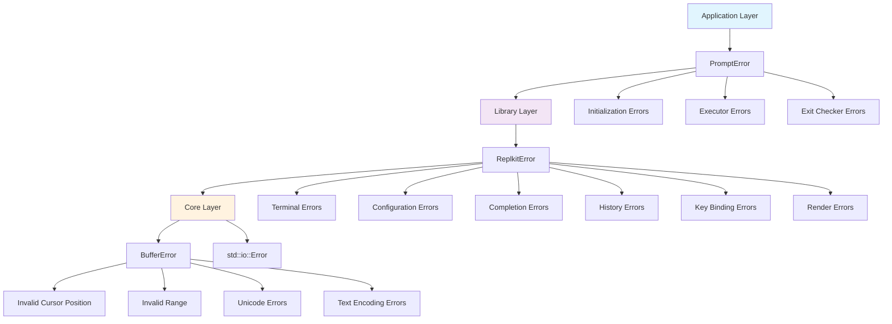

# Product Overview


## Overview

The project involves porting the go-prompt library to Rust to create a more secure and high-performance interactive prompt library.

## Key Design Principles

### 1. Rust-Native Interface Design

**Core Structure**

```rust
pub struct Prompt<T> {
    input_parser: Box<dyn InputParser>,
    buffer: Buffer,
    renderer: Box<dyn Renderer>,
    completion: CompletionManager<T>,
    history: History,
    key_bindings: KeyBindings,
    exit_checker: Option<Box<dyn ExitChecker>>,
    config: PromptConfig,
}

pub trait Executor<T> {
    fn execute(&mut self, input: &str) -> Result<T, PromptError>;
}

pub trait Completer<T> {
    fn complete(&self, document: &Document) -> Vec<Suggestion>;
}

pub trait ExitChecker {
    fn should_exit(&self, input: &str, is_break_line: bool) -> bool;
}
```

### 2. Usage Example

**Usage of go-prompt**

```go
func completer(d prompt.Document) []prompt.Suggest {
    s := []prompt.Suggest{
        {Text: "users", Description: "Store the username and age"},
        {Text: "articles", Description: "Store the article text posted by user"},
        {Text: "comments", Description: "Store the text commented to articles"},
    }
    return prompt.FilterHasPrefix(s, d.GetWordBeforeCursor(), true)
}

func main() {
    fmt.Println("Please select table.")
    t := prompt.Input("> ", completer)
    fmt.Println("You selected " + t)
}
```

**Corresponding Replkit (Rust) APIs**
```rust
use replkit::prelude::*;

fn completer(document: &Document) -> Vec<Suggestion> {
    vec![
        Suggestion {
            text: "users".to_string(),
            description: "Store the username and age".to_string(),
        },
        Suggestion {
            text: "articles".to_string(),
            description: "Store the article text posted by user".to_string(),
        },
        Suggestion {
            text: "comments".to_string(),
            description: "Store the text commented to articles".to_string(),
        },
    ]
    .into_iter()
    .filter(|s| {
        document.get_word_before_cursor()
            .chars()
            .zip(s.text.chars())
            .all(|(a, b)| a.to_lowercase().eq(b.to_lowercase()))
    })
    .collect()
}

fn main() -> Result<(), Box<dyn std::error::Error>> {
    println!("Please select table.");
    
    let mut prompt = Prompt::builder()
        .with_prefix("> ")
        .with_completer(completer)
        .build()?;
    
    let result = prompt.input()?;
    println!("You selected {}", result);
    
    Ok(())
}
```

### 3. Configuration via Builder Pattern

```rust
let mut prompt = Prompt::builder()
    .with_prefix("> ")
    .with_completer(my_completer)
    .with_history_size(1000)
    .with_key_bindings(KeyBindMode::Emacs)
    .with_exit_checker(|input, _| input == "exit")
    .with_completion_on_down(true)
    .build()?;

// Run Mode
prompt.run(|input| {
    println!("You entered: {}", input);
    Ok(())
})?;

// Input Mode
let input = prompt.input()?;
```

### 4. Error Handling

**Hierarchical Error Design**

We employ a three-tier error hierarchy that provides appropriate granularity for different use cases:



**Error Type Definitions**

```rust
// Low-level: Core text buffer operations
#[derive(Debug, thiserror::Error)]
pub enum BufferError {
    #[error("Invalid cursor position {position} (max: {max})")]
    InvalidCursorPosition { position: usize, max: usize },
    
    #[error("Invalid range {start}..{end}")]
    InvalidRange { start: usize, end: usize },
    
    #[error("Unicode error: {0}")]
    UnicodeError(String),
    
    #[error("Text encoding error: {0}")]
    TextEncodingError(String),
    // ... other buffer-specific errors
}

// Mid-level: Library-wide operations
#[derive(Debug, thiserror::Error)]
pub enum ReplkitError {
    #[error("Buffer error: {0}")]
    Buffer(#[from] BufferError),
    
    #[error("I/O error: {0}")]
    Io(#[from] std::io::Error),
    
    #[error("Terminal error: {0}")]
    Terminal(String),
    
    #[error("Configuration error: {0}")]
    Configuration(String),
    
    #[error("User exit")]
    UserExit,
    
    #[error("Completion error: {0}")]
    Completion(String),
    
    #[error("History error: {0}")]
    History(String),
    
    #[error("Key binding error: {0}")]
    KeyBinding(String),
    
    #[error("Render error: {0}")]
    Render(String),
}

// High-level: Application-facing operations
#[derive(Debug, thiserror::Error)]  
pub enum PromptError {
    #[error(transparent)]
    Core(#[from] ReplkitError),
    
    #[error("Prompt initialization failed: {0}")]
    Initialization(String),
    
    #[error("Executor failed: {0}")]
    Executor(String),
    
    #[error("Exit checker failed: {0}")]
    ExitChecker(String),
}

// Result type aliases for convenience
pub type BufferResult<T> = Result<T, BufferError>;
pub type ReplkitResult<T> = Result<T, ReplkitError>;
pub type PromptResult<T> = Result<T, PromptError>;
```

**Usage Examples**

```rust
// Core operations (internal use)
fn insert_text(&mut self, text: &str) -> BufferResult<()> {
    // Returns BufferError for low-level text operations
    if self.cursor_position > self.text.len() {
        return Err(BufferError::InvalidCursorPosition { 
            position: self.cursor_position, 
            max: self.text.len() 
        });
    }
    // ... implementation
    Ok(())
}

// Library-level operations
fn setup_terminal(&mut self) -> ReplkitResult<()> {
    // Returns ReplkitError, automatically converts from I/O and buffer errors
    self.terminal.setup_raw_mode()?; // std::io::Error -> ReplkitError
    self.buffer.initialize()?;        // BufferError -> ReplkitError
    Ok(())
}

// Application-level operations
fn run<F>(&mut self, executor: F) -> PromptResult<()>
where
    F: Fn(&str) -> PromptResult<()>,
{
    // Returns PromptError, encompasses all lower-level errors
    self.setup_terminal()?;           // ReplkitError -> PromptError
    
    loop {
        let input = self.read_input()?;
        executor(&input)?;
        
        if self.should_exit(&input) {
            break;
        }
    }
    
    Ok(())
}
```

**Error Conversion Flow**

The hierarchical design allows automatic error conversion using `#[from]` annotations:

```rust
// Automatic conversions:
// BufferError -> ReplkitError -> PromptError
// std::io::Error -> ReplkitError -> PromptError

// Example of error propagation:
fn complex_operation() -> PromptResult<String> {
    // This buffer operation may return BufferError
    self.buffer.insert_text("hello")?;  // BufferError -> ReplkitError -> PromptError
    
    // This I/O operation may return std::io::Error  
    let file_content = std::fs::read_to_string("config.toml")?;  // io::Error -> ReplkitError -> PromptError
    
    // This terminal operation may return ReplkitError
    self.terminal.clear_screen()?;  // ReplkitError -> PromptError
    
    Ok(file_content)
}
```


### Completion Manager and Suggestion

```rust
pub struct CompletionManager<T> {
    completer: Box<dyn Completer<T>>,
    suggestions: Vec<Suggestion>,
    selected: Option<usize>,
    max_display: usize,
    word_separator: String,
    show_at_start: bool,
}

pub struct Suggestion {
    pub text: String,
    pub description: String,
}
```
